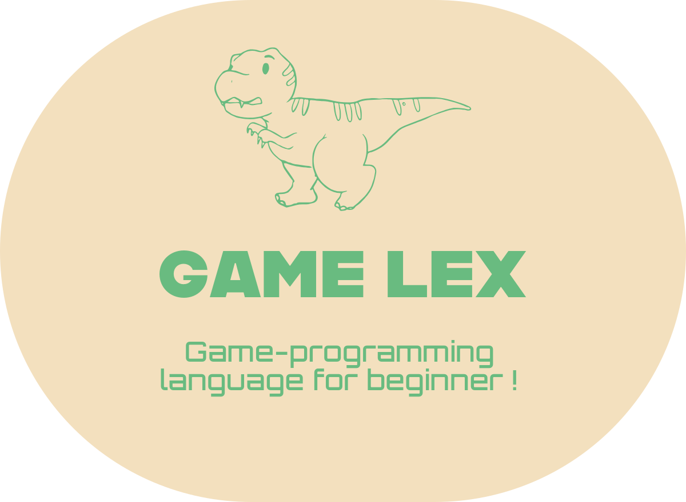

# Game Lex (GLEX)
This language is intended to be used by students who are interested in programming.

## Purpose of this project
`Game-Lex` is designed to make programming more accessible to students who are interested in game development.
By providing a user-friendly environment and intuitive tools, our goal is to empower learners to explore the world of programming through game creation.

## Development Roadmap

Our development roadmap outlines the current progress of the project and upcoming milestones.
We are actively working on implementing the assembly and high-level language features of Game-Lex,
as well as developing the Game-Lex Editor for a seamless coding experience.

##  How to Contribute to this project
Contributing to Game-Lex is easy, and we welcome contributions from everyone, regardless of skill level.
Whether you're a seasoned developer or just starting out, you can contribute by submitting pull requests or raising issues on GitHub.

## Milestones
### Assembly of GameLex
- [ ] Implement Assembly of Game-Lex.
- [ ] Allow Assembly of GameLex to compile Game-Lex bytecode.

### High-Level GameLex Language
- [ ] Implement High-Level Game-Lex Language.
- [ ] Allow Game-Lex Language to compile Game-Lex Assembly.

### GameLex Editor
- [ ] Implement Game-Lex Editor.

### WebSite
- [ ] Launch Game-Lex Website to communicate with other Game-Lex programmers.
- [ ] Write documentation for beginner programmers.
- [ ] Write standard library documentation.
